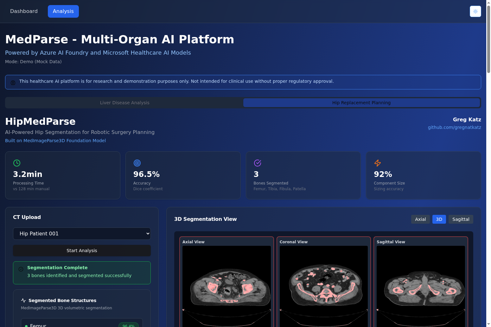
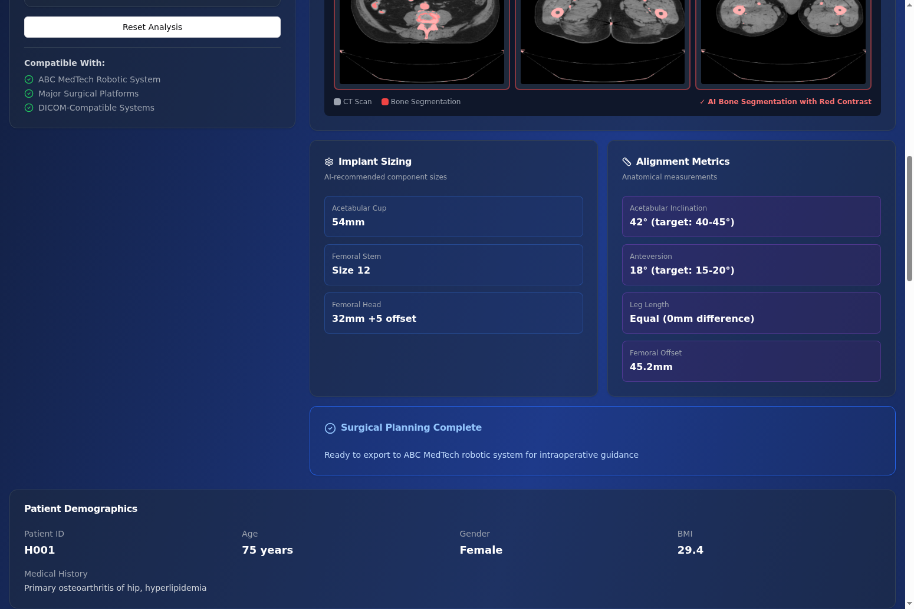
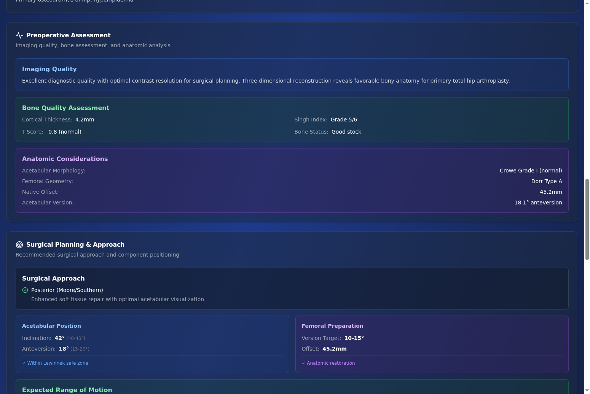
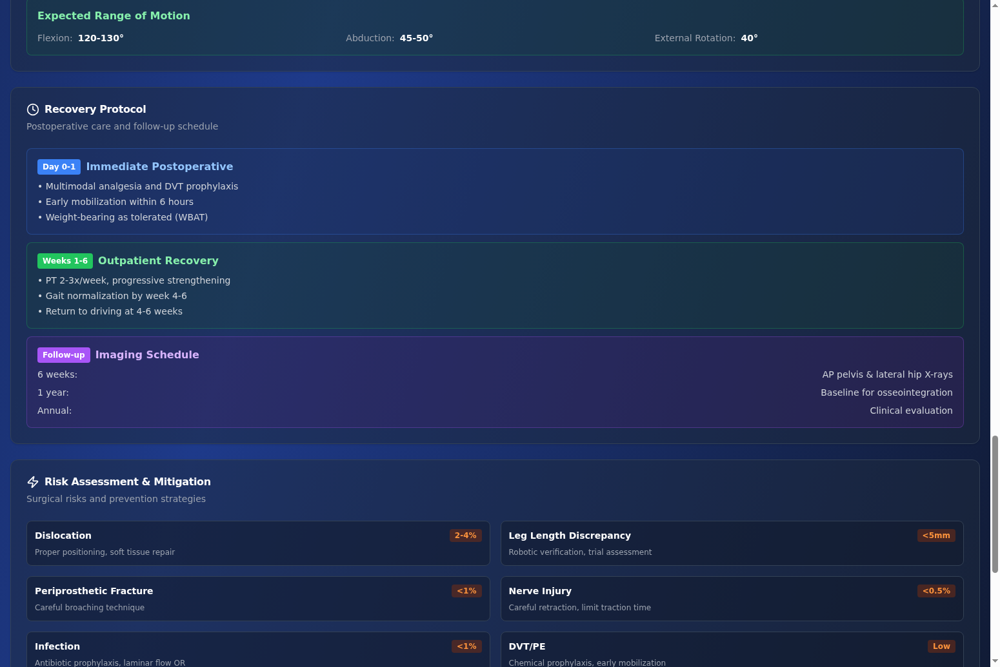
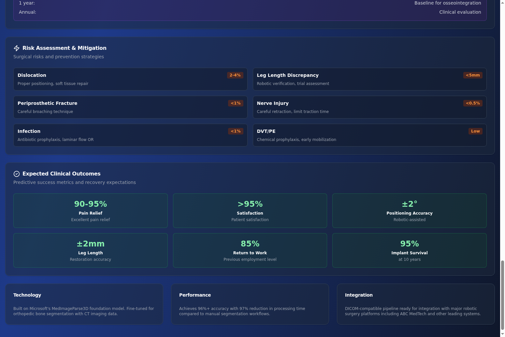
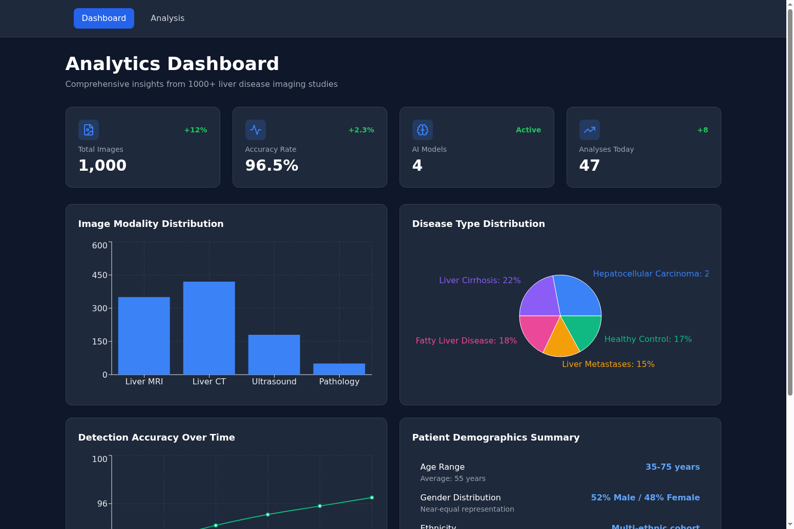
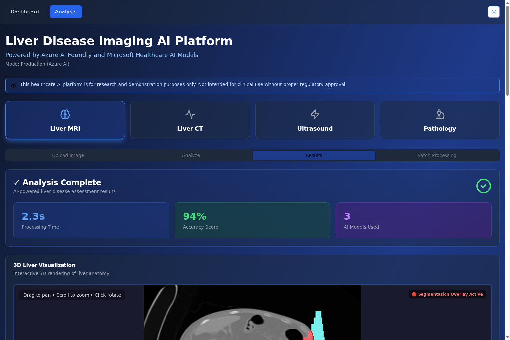
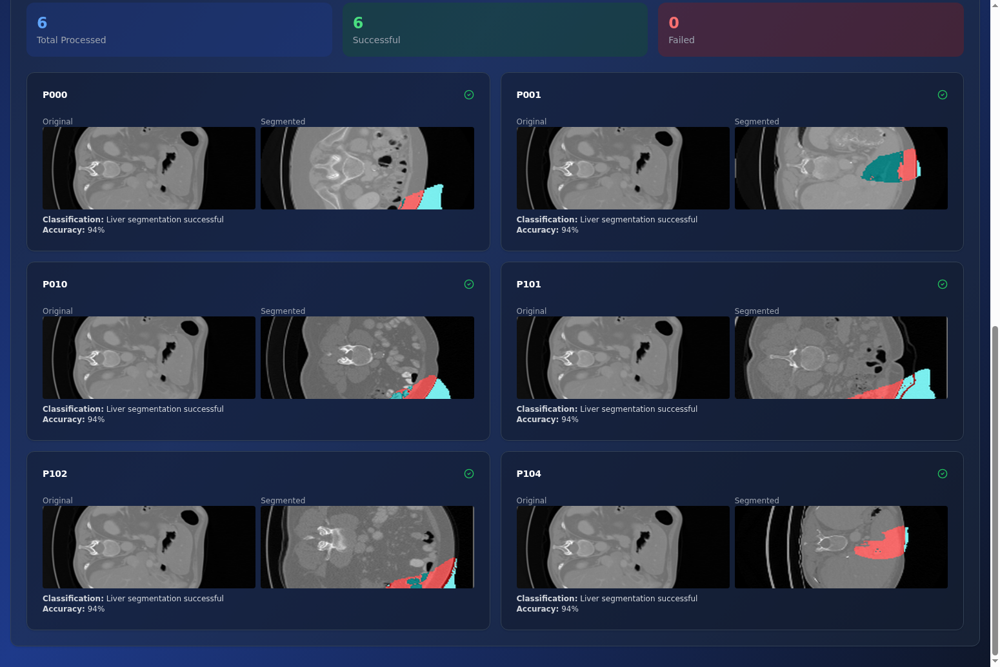

# Multi-Organ Medical Imaging AI Platform

A comprehensive medical imaging AI demonstration platform for surgical planning and disease analysis, powered by Azure AI services and advanced medical imaging models. Features AI-powered segmentation for liver disease analysis and hip replacement surgical planning.


## 🎯 Overview

This platform demonstrates state-of-the-art AI capabilities for medical image analysis using Microsoft Azure AI services integrated with **MedImageParse3D** for 3D organ segmentation and **GPT-4.1** for comprehensive clinical analysis. The platform showcases a multi-organ approach with current implementations for liver disease detection and hip replacement surgical planning.

### Key Capabilities

✅ **Multi-Organ Support**: Liver disease analysis + Hip replacement planning (extensible to knee, spine, etc.)  
✅ **Real Medical Data**: 123 liver CT scans + 58 hip CT scans from public medical imaging repositories  
✅ **AI-Powered Segmentation**: MedImageParse3D foundation model for accurate bone/organ segmentation  
✅ **Clinical Analysis**: GPT-4.1 generates comprehensive surgical planning and diagnostic reports  
✅ **Professional UI**: Card-based interface with color-coded sections for quick scanning  
✅ **Robotic Surgery Compatible**: Output format ready for Mako, ROSA, and CORI surgical systems

## ⚠️ IMPORTANT: Test Data Disclaimer

**THIS APPLICATION USES FICTITIOUS TEST DATA ONLY FROM PUBLICLY AVAILABLE KAGGLE DATASETS.**

- **Dataset Source**: [Kaggle 3D Liver Tumor Segmentation Dataset](https://www.kaggle.com/datasets/gauravduttakiit/3d-liver-and-liver-tumor-segmentation)
- **Patient Data**: 123 unique de-identified NIfTI volumes (liver_0.nii through liver_122.nii)
- **Patient IDs**: P000 through P122 (fictitious identifiers for demonstration purposes)
- **NO REAL PATIENT DATA**: All imaging data, demographics, and clinical information are synthetic or from public research datasets
- **Research Use Only**: This platform is for research, education, and demonstration purposes only
- **Not for Clinical Use**: NOT intended for clinical diagnosis, treatment decisions, or patient care without proper regulatory approval and validation

All data has been de-identified and contains no HIPAA-protected health information. Any patient demographics or clinical information displayed in the application are randomly generated for demonstration purposes only.

## ✨ Features

### Liver Disease Analysis

- **Dashboard Analytics**: Comprehensive analytics dashboard with charts showing:
  - Total image analysis count and accuracy metrics
  - Modality distribution (MRI, CT, Ultrasound, Pathology)
  - Disease classification breakdown with pie chart
  - Accuracy trends over time with line graph
  
- **Patient Selection**: Select from 123 unique patients (P000-P122) from Kaggle NIfTI dataset

- **Red Tumor Overlay Visualization**: Color-coded segmentation highlighting:
  - **Bright red (RGB: 255, 0, 0)** for tumor regions
  - Subtle red tint for liver parenchyma
  - Grayscale base for original liver anatomy

- **Batch Processing**: Analyze up to 20 patients serially with comprehensive results dashboard

- **Interactive 2D Image Viewer**: Zoom, rotate, pan, and reset controls

### Hip Replacement Planning 🆕

- **Real Patient CT Scans**: 58 de-identified hip CT scans from TCIA PELVIC-REFERENCE-DATA collection

- **6-Panel CT Visualization**: Axial, Coronal, Sagittal, and 3D views with pink/red bone segmentation overlays

- **Patient Selection**: Browse 58 real patient cases with demographics

- **Comprehensive Surgical Planning Cards**:
  - **Segmented Bone Structures** (green accuracy badges): Femur, Pelvis, Acetabulum
  - **Implant Sizing** (blue boxes): Acetabular Cup, Femoral Stem, Femoral Head recommendations
  - **Alignment Metrics** (purple boxes): Inclination, Anteversion, Leg Length, Offset measurements

- **5 Beautiful Clinical Analysis Cards**:
  1. **Preoperative Assessment**: Imaging quality, bone quality assessment (cortical thickness, Singh Index, T-Score), anatomic considerations
  2. **Surgical Planning & Approach**: Surgical approach details, acetabular/femoral positioning, expected range of motion
  3. **Recovery Protocol**: Timeline with color-coded badges (Day 0-1, Weeks 1-6, Follow-up)
  4. **Risk Assessment & Mitigation**: 6 risk categories with percentages and mitigation strategies
  5. **Expected Clinical Outcomes**: 6 outcome metrics with large bold numbers (pain relief, satisfaction, accuracy, etc.)

- **Professional Medical UI**: 
  - Color-coded sections for visual hierarchy
  - Badges and highlights for quick scanning
  - Grid layouts for organized data presentation
  - Professional medical imaging aesthetic

### General Features

- **Multi-Modal Image Analysis**: Support for MRI, CT, Ultrasound, and Pathology imaging
- **MedImageParse3D Integration**: Azure ML endpoint for 3D organ/bone segmentation
- **GPT-4.1 Clinical Analysis**: AI-powered clinical insights and surgical planning recommendations
- **Dark/Light Mode Toggle**: Responsive UI with theme support throughout
- **Research Disclaimers**: Clear warnings that this is for research/demo purposes only

### Tech Stack

**Backend:**
- FastAPI (Python 3.12)
- Poetry for dependency management
- Mock Azure AI services (ready to switch to real endpoints)

**Frontend:**
- React + TypeScript + Vite
- Tailwind CSS for styling
- React Three Fiber for landing page 3D liver model
- Recharts for analytics dashboard
- Lucide React for icons

**Data:**
- Kaggle datasets: 3D Liver Tumor Segmentation (2.2GB) + CHAOS T1&T2 (588MB)
- Total: 2.8GB of liver disease imaging data
- Location: `/home/ubuntu/medical-ai-demo/data/kaggle/`
- **Format**: NIfTI (.nii, .nii.gz) 3D volumes - fully compatible with MedImageParse3D for complete 3D volume analysis including tumor segmentation, size measurement, and staging

## 🚀 Environment Setup

### Prerequisites

- Python 3.12+ (managed via pyenv)
- Node.js 18+ (managed via nvm)
- Poetry for Python dependency management
- npm for Node.js dependencies

### Backend Setup

1. Navigate to backend directory:
   ```bash
   cd backend
   ```

2. Install dependencies:
   ```bash
   poetry install
   ```

3. Configure environment variables:
   ```bash
   cp .env.example .env
   ```
   
   Edit `.env` and fill in your Azure credentials:
   - `AZURE_OPENAI_ENDPOINT`: Your Azure OpenAI resource endpoint
   - `AZURE_OPENAI_API_KEY`: Your Azure OpenAI API key
   - `AZURE_OPENAI_DEPLOYMENT_GPT41`: Your GPT-4.1 deployment name
   - `MEDIMAGEPARSE3D_ENDPOINT`: Your MedImageParse3D Azure ML endpoint
   - `MEDIMAGEPARSE3D_API_KEY`: Your MedImageParse3D API key
   
   **IMPORTANT**: Never commit `.env` files to the repository!

4. Start the backend server:
   ```bash
   poetry run fastapi dev app/main.py
   ```

### Frontend Setup

1. Navigate to frontend directory:
   ```bash
   cd frontend
   ```

2. Install dependencies:
   ```bash
   npm install
   ```

3. Configure environment variables:
   ```bash
   cp .env.example .env
   ```
   
   Edit `.env`:
   ```
   VITE_API_URL=http://localhost:8000
   ```

4. Start the frontend development server:
   ```bash
   npm run dev
   ```

5. Access the application:
   - Frontend: http://localhost:5173/
   - Backend API: http://localhost:8000/
   - API Docs: http://localhost:8000/docs


## 🤖 AI Models Architecture

This platform integrates 2 specialized Azure AI models for streamlined liver disease analysis:

### 1. MedImageParse3D
**Purpose:** Volumetric 3D segmentation  
**What it adds:** Complete 3D volume analysis for CT/MRI scans. Critical for accurate tumor size measurement, volumetric assessment, staging, and surgical planning. Processes entire NIfTI volumes for comprehensive liver analysis.  
**Use case:** 3D liver segmentation, tumor reconstruction, volume calculation, preoperative planning, disease staging

### 2. GPT-4.1
**Purpose:** Clinical reasoning and analysis  
**What it adds:** Advanced language model that synthesizes 3D segmentation findings into comprehensive clinical reports. Provides differential diagnoses, confidence assessments, and recommended follow-up actions using state-of-the-art reasoning capabilities.  
**Use case:** Clinical report generation, diagnostic reasoning, patient communication, decision support

### Integration Flow

```
Input Image (NIfTI 3D Volume)
    ↓
MedImageParse3D → [3D Liver Segmentation]
    ↓
GPT-4.1 → [Clinical Analysis & Report]
    ↓
Structured Output with Visualizations
```

## 🧬 MedImageParse3D Integration

### Overview
MedImageParse3D is Microsoft's state-of-the-art model for 3D volumetric segmentation of medical images, specifically optimized for CT and MRI scans.

### Implementation Details

**Input Format**: NIfTI (.nii) volumes
- The application uses the Kaggle 3D Liver Tumor Segmentation dataset
- 123 unique liver scans (liver_0.nii through liver_122.nii)
- Each scan is a 3D volume with dimensions typically 512×512×N slices

**Data Preprocessing**:
1. Load NIfTI file using `nibabel`
2. Compress with gzip (required by Azure ML endpoint)
3. Encode to base64 for API transmission
4. Send to MedImageParse3D endpoint with organ="liver"

**Segmentation Output**:
- Returns gzipped NIfTI mask as base64-encoded JSON
- Mask values: 0 (background), 1 (liver parenchyma), 2 (tumor)
- Decoded and converted to red overlay PNG for visualization

**Red Overlay Generation**:
- Decodes gzipped NIfTI segmentation mask
- Applies bright red (RGB: 255, 0, 0) to tumor regions (mask value 2)
- Applies subtle red tint to liver parenchyma (mask value 1)
- Returns base64-encoded PNG for frontend display

## 📊 Batch Processing

### Current Implementation (Serial Processing)
The application supports analyzing up to 20 patients serially:
- Select multiple patients from dropdown (P000-P122)
- Each patient is analyzed sequentially
- Results displayed in a grid layout with original and segmented images
- Processing time: ~2-3 seconds per patient

### API Endpoint
```python
POST /api/analyze/batch
Content-Type: multipart/form-data

patient_ids: "P000,P045,P100"  # Comma-separated patient IDs
modality: "liver-mri"
```

### Optional Enhancement: Parallel Processing for Production

For production deployments requiring high throughput, batch processing can be parallelized:

**Implementation Strategy:**
1. **Azure Batch or Azure Functions**: Deploy MedImageParse3D calls as parallel functions
2. **Queue-based Processing**: Use Azure Service Bus or Storage Queue for job management
3. **Async/Await Pattern**: Utilize Python's `asyncio.gather()` for concurrent processing
4. **Rate Limiting**: Implement throttling to respect Azure ML endpoint quotas

**Code Example** (not currently implemented):
```python
async def analyze_batch_parallel(patient_ids: List[str], modality: str):
    tasks = [
        analyze_image_by_patient(patient_id, modality)
        for patient_id in patient_ids
    ]
    results = await asyncio.gather(*tasks, return_exceptions=True)
    return results
```

**Considerations**:
- Monitor Azure ML endpoint rate limits and quotas
- Implement exponential backoff for transient failures
- Consider cost implications of parallel processing
- Test with production load to determine optimal concurrency level


## 📁 Project Structure

```
livermedparse/
├── backend/
│   ├── app/
│   │   ├── main.py              # FastAPI application with all routes
│   │   ├── services.py          # AI service implementations (MedImageParse3D, GPT-4.1)
│   │   └── config.py            # Configuration management
│   ├── data/
│   │   ├── kaggle/              # Kaggle liver dataset (123 patients)
│   │   └── tcia_pelvic/         # TCIA hip CT scans (58 patients)
│   ├── scripts/                 # Data processing scripts
│   ├── pyproject.toml           # Python dependencies
│   └── .env                     # Environment variables (not in git)
├── frontend/
│   ├── src/
│   │   ├── App.tsx              # Main application with tab navigation
│   │   ├── LandingPage.tsx      # Landing page component
│   │   ├── Liver3DViewer.tsx    # Liver analysis component
│   │   ├── HipDemo.tsx          # Hip replacement planning component 🆕
│   │   ├── AnalyticsDashboard.tsx # Analytics dashboard
│   │   └── SpinningLiver.tsx    # 3D spinning liver model
│   ├── public/
│   │   └── logo.png             # Application logo
│   ├── package.json             # Node.js dependencies
│   └── .env                     # Environment variables (not in git)
├── docs/
│   └── screenshots/             # Application screenshots for documentation
├── README.md                    # This file
└── HIP_IMPLEMENTATION_GUIDE.md  # Detailed implementation guide for hip feature
```

## 🔍 API Endpoints

### Health & Configuration

- `GET /healthz` - Health check endpoint
- `GET /api/config` - Get application configuration

### Liver Analysis

- `GET /api/patients` - List available liver patients (P000-P122)
- `POST /api/analyze` - Analyze liver image by patient ID or uploaded file
  - **Input**: `multipart/form-data` with optional image file, modality, patient_id
  - **Output**: Segmentation, GPT-4.1 analysis, metrics, demographics
- `POST /api/analyze/batch` - Batch analyze multiple liver patients
  - **Input**: `multipart/form-data` with comma-separated patient_ids and modality
  - **Output**: Array of analysis results
- `POST /api/upload-demo` - Load demo liver image from Kaggle dataset
  - **Input**: `application/json` with modality and optional patient_id
  - **Output**: Demo image data from NIfTI file
- `GET /api/analytics` - Get analytics data for liver dashboard
  - **Output**: Total images, accuracy, distributions, demographics

### Hip Replacement Planning 🆕

- `GET /api/hip/patients` - List available hip patients from TCIA dataset (58 patients)
  - **Output**: Array of patient objects with ID, age, gender, BMI, medical history
- `POST /api/process-hip` - Process hip CT scan and generate surgical planning
  - **Input**: `application/json` with patient_id
  - **Output**: Segmentation masks, implant sizing, alignment metrics, clinical analysis cards

### API Documentation

Interactive API documentation available at: http://localhost:8000/docs (Swagger UI)

## 🧪 Implementation Notes

### ✅ Interactive 2D Image Viewer

**Approach:** Replaced complex WebGL-based 3D viewer with a simple, reliable 2D image viewer using standard HTML and CSS.

**Implementation:**
- Uses HTML `` element with CSS transforms for zoom, rotate, and pan
- Interactive controls: Zoom In/Out, Rotate 90°, Reset View
- Drag-to-pan and scroll-to-zoom support
- Lucide React icons for control buttons
- Maintains dark/light mode support

**Benefits:**
- No WebGL context issues or browser compatibility problems
- Faster loading and better performance
- Simpler codebase, easier to maintain
- Works reliably with base64 image data

**Controls:**
```typescript
// Zoom: CSS scale() transform
// Rotate: CSS rotate() transform (90° increments)
// Pan: CSS translate() transform with drag handlers
// Reset: Returns all transforms to initial state
```

## 📸 Screenshots

### Hip Replacement Planning

#### 1. Overview with Real CT Scans

*Real hip CT scans with pink/red bone segmentation overlays, performance metrics, and patient selection*

#### 2. Implant Sizing & Alignment Metrics

*AI-generated implant sizing recommendations and alignment measurements for surgical planning*

#### 3. Preoperative Assessment Card

*Comprehensive preoperative assessment with color-coded sections for imaging quality, bone quality, and anatomic considerations*

#### 4. Recovery Protocol & Risk Assessment

*Timeline-based recovery protocol and detailed risk assessment with mitigation strategies*

#### 5. Clinical Outcomes

*Expected clinical outcomes with large metric numbers showing pain relief, satisfaction, and positioning accuracy*

### Liver Disease Analysis

#### Dashboard

*Analytics-first dashboard showing total analyses, accuracy metrics, modality distribution, and disease classification*

#### Analysis with Red Tumor Overlay

*Liver scan showing bright red tumor segmentation overlay with GPT-4.1 clinical analysis*

#### Batch Processing

*Batch processing UI for analyzing multiple patients with comprehensive results dashboard*

## ⚠️ Important Notes

### Research Use Only

This platform uses Kaggle medical imaging datasets for research and demonstration purposes only. All data is de-identified and contains no HIPAA-protected health information. **This system is NOT intended for clinical diagnosis or treatment decisions.**

### Security

- Never commit API keys or secrets to the repository
- Use environment variables for all sensitive configuration
- Follow Azure security best practices
- Implement proper authentication before production use

## 📚 References

- [Azure AI Foundry Documentation](https://learn.microsoft.com/en-us/azure/ai-services/)
- [MedImageParse3D Model Card](https://aka.ms/healthcare-ai-examples)
- [Kaggle 3D Liver Tumor Dataset](https://www.kaggle.com/datasets/gauravduttakiit/3d-liver-and-liver-tumor-segmentation)
- [NIfTI File Format Specification](https://nifti.nimh.nih.gov/)
- [Azure Machine Learning Endpoints](https://learn.microsoft.com/en-us/azure/machine-learning/how-to-deploy-online-endpoints)


---
